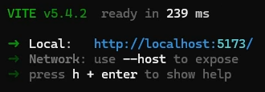

# Weather Application

An application that shows the current weather of any city using the [Open-Meteo](https://open-meteo.com/en/docs) free forecast API. Also uses [Big Data Cloud](https://www.bigdatacloud.com/) for reverse searching and geolocating. Built using React+Vite on [stackblitz](https://stackblitz.com/).

## Running the application

You will need to have npm and Node.js installed on your system.  

- First either clone the repository or download it as a zip and navigate to the root folder of the application.
- Open the folder in the command line of your choice.
- Run `npm install`. This will install the appropriate libraries for the project.
- Run `npm run dev`. This will start the project.
- The command line should return a link to where the project is now being hosted locally. Something like this:
  
- Navigate to the local link using the browser of your choice. The app should be running.

